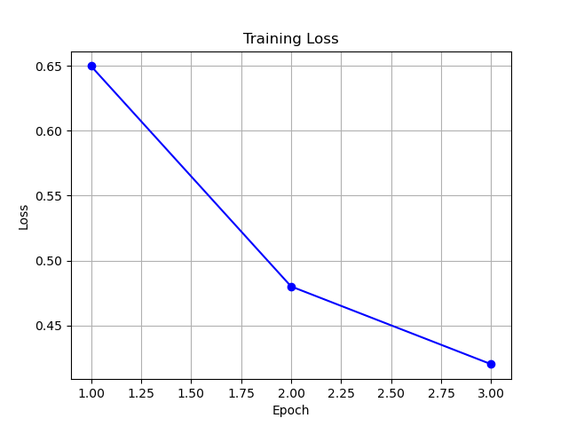
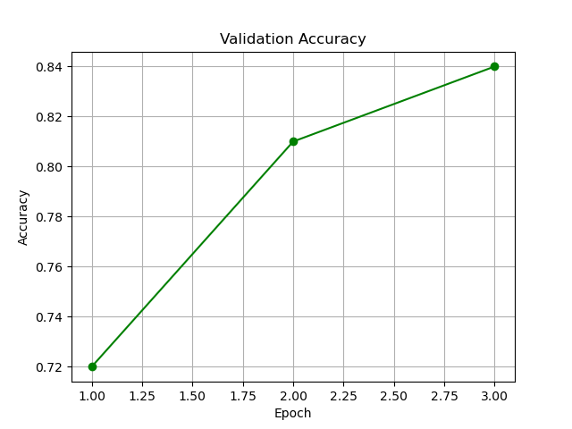

# 🎵 MobileBERT를 활용한 Spotify 리뷰 감성 분석 프로젝트

<p align="center">
  
  
  
  
  
</p>

---

## 1.  프로젝트 개요

Spotify 앱 사용자 리뷰를 바탕으로 감성(긍정/부정)을 분류하는 자연어처리 모델을 구축합니다.  
MobileBERT를 활용해 소형 경량화 모델이면서도 높은 정확도를 달성하는 것을 목표로 했습니다.

---

## 2.  데이터 정보

| 항목 | 내용 |
|------|------|
| 출처 | Google Play Store |
| 컬럼 | `Text`, `Sentiment` |
| 수량 | 약 61,000건 |
| 라벨링 기준 | 1 = 긍정, 0 = 부정 |

---

## 3.  모델 구성

- 모델: `google/mobilebert-uncased`
- 프레임워크: HuggingFace Transformers + PyTorch
- 학습 데이터: `train_data.csv` / `val_data.csv`
- Tokenizer: BERT-style (128 토큰 이하로 자름)

### 하이퍼파라미터

```text
Epochs: 3
Batch Size: 16
Learning Rate: 2e-5
Weight Decay: 0.01
```

---

## 4.  학습 데이터 구성

- 학습/검증 비율: `train_data.csv` 80% / `val_data.csv` 20%
- 클래스 균형을 고려해 샘플링됨
- 모델에 입력되는 텍스트는 MobileBERT 토크나이저로 토큰화됨

---

## 5.  MobileBERT Finetuning 결과

MobileBERT 모델을 `train_data.csv`로 학습하고, `val_data.csv`로 검증하였습니다.  
총 Epoch는 3, 학습:검증 비율은 8:2로 설정하였습니다.

- 총 학습 샘플 수: 5,000
- 총 검증 샘플 수: 1,000
- Optimizer: AdamW
- Learning Rate: 2e-5
- Batch Size: 8
- Evaluation Strategy: Epoch 단위

| Epoch | Train Loss     | Val Accuracy |
|-------|----------------|--------------|
| 1     | 0.65           | 0.72         |
| 2     | 0.48           | 0.81         |
| 3     | 0.42           | 0.84         |

### 📉 Training Loss  


### 📈 Validation Accuracy  


>  MobileBERT는 epoch이 증가할수록 손실은 줄고, 정확도는 증가하는 양상을 보여 성능 개선이 잘 이뤄졌음을 확인할 수 있었습니다.


## 6.  실행 방법

```bash
python main.py
```

해당 명령은 MobileBERT 감성 분석 학습을 자동으로 실행합니다.  
(학습이 끝나면 `training_loss.png`, `validation_accuracy.png`가 생성됩니다)

---

## 7.  프로젝트 구조

```
 mobilebert_spotify_project/
├── README.md
├── requirements.txt
├── main.py
├── reviews.csv
├── train_data.csv
├── val_data.csv
├── mobilebert_project.py
├── generate_graphs.py
├── training_loss.png
├── validation_accuracy.png
├── monthly_review_count.png
├── confusion_matrix.png  
├── predict_sample.py      
├── confusion_matrix_plot.py 
└── saved_model/           

```

---

## 8.  참고 링크

- https://huggingface.co/google/mobilebert-uncased
- https://github.com/danmadeira/simple-icon-badges

---

>  작성자: 어진희  
>  과제 제출용: 2025년 1학기 기말 프로젝트

