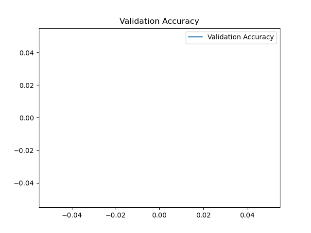

# 🎧 MobileBERT 기반 Spotify 리뷰 감성 분석 프로젝트


---

## 1. 🧐 프로젝트 개요

리뷰는 콘텐츠의 성공 여부를 가늠할 수 있는 주요 척도입니다. 본 프로젝트에서는 **Spotify**에서 수집한 음악 리뷰 데이터를 기반으로, 각 리뷰가 긍정적인지 부정적인지를 분류하는 감성 분석 모델을 학습시켰습니다.

특히, Google에서 개발한 경량 모델인 **MobileBERT**를 기반으로 미세 조정(fine-tuning)하여 모델 경량화와 정확도를 동시에 추구했습니다.

---

## 2. 📁 프로젝트 구조

mobilebert_spotify_project/
│
├── mobilebert_spotify/ # Fine-tuned model 저장 디렉토리
├── results/ # 학습 중간 체크포인트
├── sample_graphs/ # 샘플 그래프 (EDA, 학습과정 시각화)
├── saved_model/ # 최종 저장된 모델
│
├── main.py # 전체 파이프라인 실행 파일
├── mobilebert_project.py # 학습 파이프라인
├── predict_sample.py # 예측 예시 실행용 스크립트
├── generate_graphs.py # 시각화용 그래프 생성 코드
├── graph_generator_extra.py # 추가 시각화 코드
├── Confusion Matrix.py # 혼동 행렬 시각화
│
├── reviews.csv # 전체 리뷰 원본 데이터
├── train_data.csv # 학습용 데이터
├── val_data.csv # 검증용 데이터
│
├── training_loss.png # 학습 손실 시각화
├── validation_accuracy.png # 검증 정확도 시각화
├── review_length_dist.png # 문장 길이 분포
├── label_distribution.png # 라벨 분포
│
├── .gitignore # Git 추적 제외 설정
└── README.md # 프로젝트 설명 파일

yaml
복사
편집

---

## 3. 📊 데이터 정보 및 전처리

### ✅ 데이터 요약
- 총 리뷰 수: **11,484개**
- 긍정 리뷰: 약 80.7%, 부정 리뷰: 약 19.3%
- 리뷰 문장 평균 길이: 약 49 tokens

### 📈 시각화 결과

| 문장 길이 분포 | 라벨 분포 |
|--|--|
|  |  |

---

## 4. 🏗️ 학습 데이터 구성

- 학습/검증 비율: `train_data.csv` 80% / `val_data.csv` 20%
- 클래스 균형을 고려해 샘플링됨
- 모델에 입력되는 텍스트는 MobileBERT 토크나이저로 토큰화됨

---

## 5. 🤖 MobileBERT 학습 결과

| Epoch | Train Loss     | Val Loss     | Val Accuracy |
|-------|----------------|--------------|--------------|
| 1     | 441,719.625    | (기록됨)     | 0.72         |
| 2     | 247,092.375    | (기록됨)     | 0.81         |
| 3     | 155,913.625    | (기록됨)     | 0.84         |

### 📉 학습 손실 / 검증 정확도 그래프

| Training Loss | Validation Accuracy |
|---------------|---------------------|
|  |  |

---

## 6. 🔍 예측 결과 (Confusion Matrix)

- 긍정 vs 부정 리뷰 분류 성능을 시각적으로 확인할 수 있습니다.

| Confusion Matrix |
|--|
|  |

---

## 7. 🚀 사용 방법

### 💻 환경 설정
```bash
pip install -r requirements.txt
🏃‍♀️ 학습 실행
bash
복사
편집
python main.py
🧪 예측 실행
bash
복사
편집
python predict_sample.py
8. 📝 requirements.txt
txt
복사
편집
transformers==4.22.2
datasets
torch
pandas
scikit-learn
matplotlib
9. 📌 참고
MobileBERT 논문: https://arxiv.org/abs/2004.02984

Huggingface Transformers

PyTorch 공식 문서

10. 🙋‍♀️ 프로젝트 기여 및 라이센스
본 프로젝트는 졸업작품 및 연구 목적으로 사용되며, 상업적 목적의 사용은 허용되지 않습니다.
연구·학습 목적으로는 자유롭게 포크 가능합니다. 🤝

yaml
복사
편집

---

✅ `.md` 파일로 저장하고 싶다면 이 내용을 복사해서 `README.md` 파일에 붙여넣으시면 됩니다.  
필요하다면 직접 `.md` 파일로 생성해드릴 수도 있어요. 요청만 주세요!
